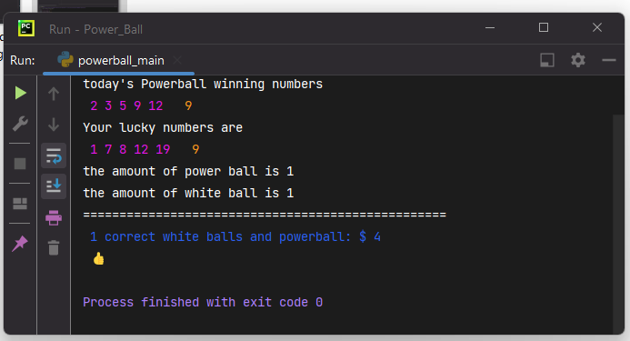

>AUTHOR        BENEL MOLLA
> 
> [Link To GitHub/BenelMolla](https://github.com/BenelMolla)
## Power_Ball
#### THIS PROJECT SHOWS ALL STEPS THAT HOW DOES THE POWERBALL GAME WORK

> The Power Ball Game Includes Two Parts.
    
  * Part One Includes 5 Numbers. These Five Numbers Are White Ball Numbers, Which Are Drawn Randomly From 20 Numbers From 1 to 20 inclusively -(1,2,3,4,5, ...,17,18,19,20).

  * Part Two Only Has One Number, The PowerBall Number, Which Is Obtained Randomly From 10 Numbers (1,2,3,4,5,6,7,8,9,10).
  * When The Program/page Is Run Or Reload /Refreshed, It Would Display Today's PowerBall Winning Numbers, Your Lucky Numbers, And Display The Result Based On Your Lucky Numbers Against Today's PowerBall Winning Numbers.
    
### I used three classes for this Project to make power_ball
>>>1, White_ball
> 
>>>2, Lucky_white
> 
>>>3, Grading
>### This picture shows the result of my code when I run this project

> # Key Words
> >* winnerwhite = --------- The five white Balls that chosen randomly
> > * five_numbers = -------- This name given for white_Ball list 
> > * one_ball = ---------- This name given for power_Ball list 
> > * power_ball =------------ here 1 Balls that chosen randomly
> > * Lucky_white = ----------- This is the class name of white_ball Balls that chosen randomly
> > * lucky_box = -------------- This name given for Lucky_white list 
> > * luckywhite1 = -------------The five white Balls that chosen randomly 
